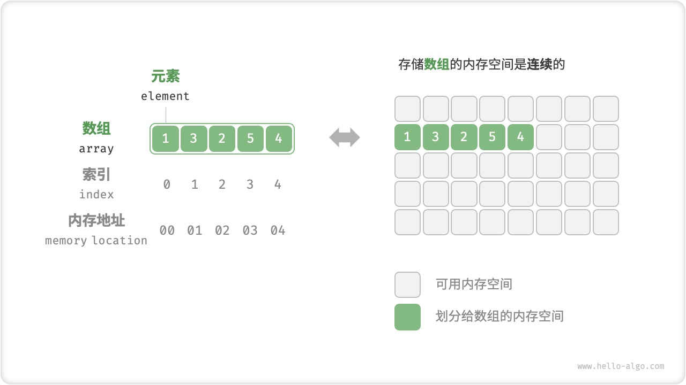
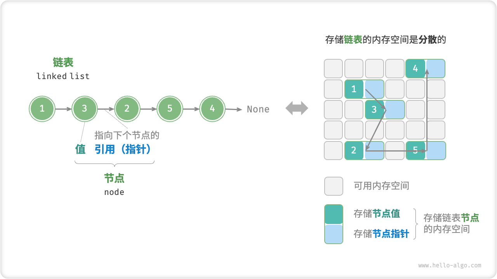

# Data Structure

## array

「数组 array」是一种线性数据结构，其将相同类型元素存储在连续的内存空间中。我们将元素在数组中的位置称为该元素的「索引 index」。

#### 优缺点

优点：

- **空间效率高**: 数组为数据分配了连续的内存块，无须额外的结构开销。
- **支持随机访问**: 数组允许在 O(1) 时间内访问任何元素。
- **缓存局部性**: 当访问数组元素时，计算机不仅会加载它，还会缓存其周围的其他数据，从而借助高速缓存来提升后续操作的执行速度。

缺点:

- **插入与删除效率低**:当数组中元素较多时，插入与删除操作需要移动大量的元素。
- **长度不可变**: 数组在初始化后长度就固定了，扩容数组需要将所有数据复制到新数组，开销很大。
- **空间浪费**: 如果数组分配的大小超过了实际所需，那么多余的空间就被浪费了。

## 链表

「链表 linked list」是一种线性数据结构，其中的每个元素都是一个节点对象，各个节点通过“引用”相连接。

------

学习站点：

1. [geeks](https://www.geeksforgeeks.org/tree-data-structure/)
2. [hello-algo](https://www.hello-algo.com/)