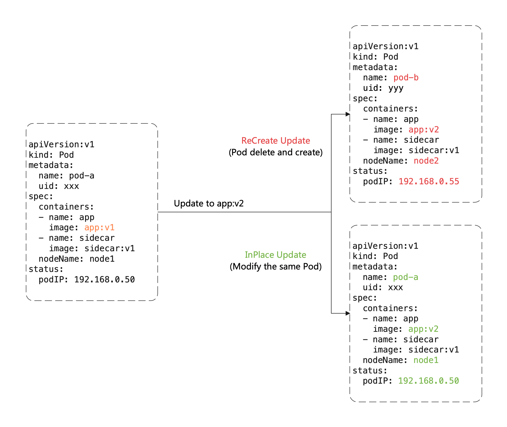
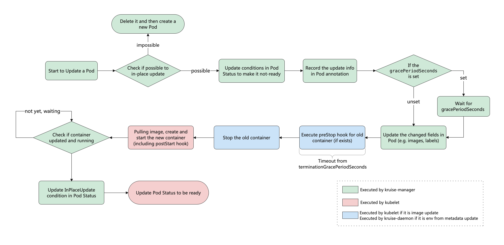

# Open Kruise

OpenKruise 是一个基于 Kubernetes 的扩展套件，主要聚焦于云原生应用的自动化，比如*部署、发布、运维以及可用性防护*。

## 核心能力

- 增强版本的workload，CloneSet、Advanced StatefulSet、Advanced DaemonSet、BroadcastJob等，除原生能力外额外支持的能力：
  - 原地升级/重启
  - 可配置的扩缩容
  - 可配置的发布策略
  - 并发操作
- 应用的旁路管理
- 高可用性防护
- 高级的运维能力

## 系统架构

kruise相关的组件都部署在kruise-system这个namespace下，包括kruise-controller-manager（通过deployment部署）、kruise-daemon（通过daemonset部署）。

## 原地升级

原地升级和重建升级的区别：

使用原地升级时，podName、podIP、pod的nodeIP（严格的原地升级时不会发生变化）都不会发生变化。当业务需要复用pod的数据（比如：一些业务在pod启动的时候会预加载大量的数据，或者有使用pv的时候）或者不希望pod的信息（如podName、podIP等）发生变化，此时可以使用原地升级的能力。

原地升级的优势：

- 可以避免如 *调度*、*分配 IP*、*分配、挂载盘* 等额外的操作和代价
- 更快的镜像拉取，因为开源复用已有旧镜像的大部分 layer 层，只需要拉取新镜像变化的一些 layer
- 当一个容器在原地升级时，Pod 中的其他容器不会受到影响，仍然维持运行

### InPlaceIfPossible

当启用InPlaceIfPossible策略时， Kruise 会尽量对 Pod 采取原地升级，如果不能则退化到重建升级。

以下的改动会被允许执行原地升级：

1. 更新 workload 中的 `spec.template.metadata.*`，比如 labels/annotations，Kruise 只会将 metadata 中的改动更新到存量 Pod 上。
2. 更新 workload 中的 `spec.template.spec.containers[x].image`，Kruise 会原地升级 Pod 中这些容器的镜像，而不会重建整个 Pod。
3. **从 Kruise v1.0 版本开始（包括 v1.0 alpha/beta）**，更新 `spec.template.metadata.labels/annotations` 并且 container 中有配置 env是来自于这些改动的 labels/anntations，Kruise 会原地升级这些容器来生效新的 env 值。

否则，其他字段的改动，比如 `spec.template.spec.containers[x].env` 或 `spec.template.spec.containers[x].resources`，都是会回退为重建升级。

### 原地升级流程

### 多容器升级顺序控制